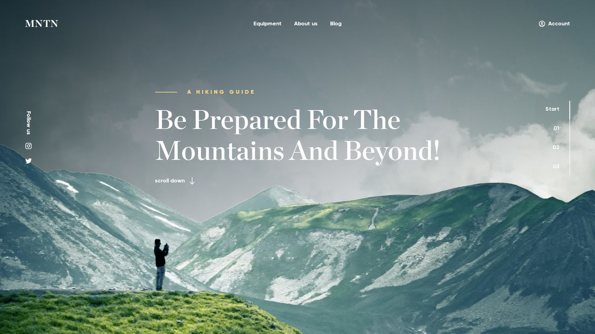

<div align="center">



# MNTN — Landing Page

**Вёрстка по готовому макету Figma. HTML и CSS, плюс один маленький скрипт для анимации.**

[**Открыть страницу →**](https://jw-git-hub.github.io/MNTN---Landing-Page/)

[Русский](#русский) · [English](#english)

</div>

---

## Русский

### Что это

Пример одной услуги: у заказчика есть макет от дизайнера — я собираю по нему
страницу, которую можно открыть в браузере, посмотреть с телефона и отправить
ссылкой.

Дизайн здесь не мой. Макет взят из Figma Community — специально чужой и ранее
не виденный, чтобы пример нельзя было подогнать задним числом. Моя работа —
всё, что между макетом и живой страницей по ссылке выше.

### Что показывает эта работа

- **Макет перенесён числами, а не на глаз.** Высота страницы в браузере —
  4600 точек, ровно как в макете; отклонения блоков — в пределах одной точки.
  Открыв макет и страницу рядом, вы увидите одно и то же.
- **Повторяющееся собрано один раз.** Три секции — один блок с тремя
  наполнениями, у второй фотография слева. Правка цвета или отступа делается
  в одном месте и сразу везде.
- **Сцена гор разложена на слои, а не вклеена картинкой.** Три гряды и два
  затемнения тянутся от ширины окна, заголовок стоит между слоями.
- **Адаптив под телефоны и планшеты сделан сверх макета — и об этом сказано
  прямо.** В макете был только десктоп 1920, оптимизации под телефоны
  и планшеты в нём не было. Мы придумали и добавили её сами: на планшете блоки
  идут в две колонки и фотография чередуется слева и справа, как на десктопе;
  на телефоне всё выстроено в одну колонку. Это наше решение, а не «как
  в макете», — оно подлежит согласованию с дизайнером.
- **Лёгкая анимация появления карточек — тоже наша добавка.** При прокрутке
  первая карточка выезжает слева, вторая справа и так далее. Анимация
  отключается, если человек выключил движение в системе, а без JavaScript
  карточки просто видны.
- **Тексты перенесены дословно**, включая опечатки оригинала. Правки в текст
  вносит тот, кому он принадлежит.
- **Сделано то, чего в макете не рисуют:** описания к фотографиям, подписи
  для навигации с клавиатуры, видимая рамка фокуса, отключение анимации,
  если человек выключил движение в системе.
- **Собрано за один заход** утром 15 сентября 2026 года, адаптив
  и анимация доработаны вечером того же дня — это видно в истории коммитов.

### Чего здесь нет

Это чистая вёрстка макета, и границу честнее назвать сразу. Страницу
**не** оптимизировали под скорость и вес, **не** готовили к поиску,
**не** размечали под ответы ИИ-ассистентов, **не** подключали аналитику,
формы и интеграции. Все ссылки — заглушки: адресов в макете не было,
они помечены в коде как открытый вопрос. Это отдельные слои работы,
они делаются поверх вёрстки.

### Ссылки

- Живая страница — <https://jw-git-hub.github.io/MNTN---Landing-Page/>
- Разбор работы человеческим языком — <https://jw-dev.pro/cases/mntn-landing-page>
- Сделаю то же по вашему макету — <https://jw-dev.pro>

<details>
<summary><b>Технические детали</b></summary>

**Стек.** HTML + CSS и один скрипт `scripts/reveal.js` (~30 строк) только
для анимации появления; без сборщика и зависимостей. Страница
работает из папки; публикация — GitHub Pages из ветки, сборка не нужна.

**Раскладка файлов.**

```
index.html
styles/
  tokens.css        значения макета: цвета, типографика, отступы, слои
  fonts.css         @font-face, пять локальных woff2
  main.css          сброс, контейнер, типографика, ссылки, тэглайн
  sections/         по файлу на секцию: header, hero, scenery, feature, footer
scripts/
  reveal.js         появление карточек при прокрутке (IntersectionObserver)
assets/
  images/           горы (png + webp), фотографии (jpg + webp, 1x и 2x)
  icons/sprite.svg  стрелка, Instagram, Twitter, Account
  fonts/            Gilroy 500/700/800, Chronicle Display 600/700
docs/preview.jpg    кадр первого экрана для этого описания
```

**Решения.** Раскладка на flex и grid; зеркальная секция — модификатор
с `order`, порядок в разметке не меняется. Сцена гор масштабируется от ширины
через container query units (`max(100cqw, 900px) / 1920`), слои разложены
по `z-index` в порядке Figma; от 1920px заголовок уходит под горы, как
в макете, ниже — поверх, иначе горы его перекрывают. Градиент пересчитан
из `gradientHandlePositions`: −19.7°, стопы 31.1% и 108.9%.

**Адаптив (не из макета).** Мобильный-первым, брейкпоинты 768 / 1280 / 1920.
До 767 — одна колонка; 768–1279 — две колонки, фото чередуется через тот же
модификатор `feature--reverse`, футер в две колонки; от 1280 — значения
макета, геометрия десктопа не изменилась до пикселя. Значения десктопа взяты
из макета, остальные выведены — в `tokens.css` это помечено у каждой группы.

**Анимация (не из макета).** Скрипт ставит `has-reveal` на `<html>`
и через `IntersectionObserver` добавляет карточке `is-revealed`, когда видно
15% её высоты. Нечётные выезжают слева, чётные — справа (`:nth-child(even)`),
сдвиг 40px на телефоне и 80px шире, 800 мс. Переход назначен только
на появление, поэтому при загрузке карточки не «уезжают» на глазах.
При `prefers-reduced-motion` скрипт ничего не делает.

**Картинки и шрифты.** `picture` с webp и джипегом-запасным, `srcset` 1x/2x,
`loading="lazy"` ниже первого экрана, `fetchpriority="high"` у дальнего слоя
гор. Шрифты — локальные woff2, `font-display: swap`, два начертания первого
экрана предзагружены. Первая загрузка на 1920 — около 0,7 МБ.

**Доступность.** Семантические секции, `aria-label` у навигаций и иконок,
`aria-labelledby` у секций, `aria-hidden` у декора, `:focus-visible`,
`prefers-reduced-motion` (плавная прокрутка и анимация карточек).

**Замер.** Каждая секция после вёрстки сверялась с координатами фрейма Figma:
отклонения в пределах 1px. Осознанных расхождений два: «Account» 18px вместо
17px (единый кегль интерфейса) и копирайт, который не повторяет случайный сдвиг
макета на 6px. Ещё два отличия — не решения, а поведение браузера: двойной
пробел в заголовке второй секции схлопывается, а трекинг тэглайнов добавляет
6px после последней буквы, не сдвигая текст.

</details>

### Права

Репозиторий опубликован только для ознакомления — см. [LICENSE](LICENSE).
Макет (Figma Community), шрифты Gilroy и Chronicle Display и фотографии
принадлежат их правообладателям и включены исключительно ради демонстрации
вёрстки.

---

## English

### What this is

A demonstration of one service: the client has a designer's mockup, and I turn
it into a page you can open in a browser, view on a phone and send as a link.

The design is not mine. The mockup comes from the Figma Community — deliberately
someone else's and previously unseen, so the example cannot be quietly tailored
to fit. My work is everything between that mockup and the live page linked above.

### What this work demonstrates

- **The mockup was transferred by numbers, not by eye.** Page height in the
  browser is 4600 px, exactly as in the mockup; block offsets stay within one
  pixel. Put the mockup and the page side by side and you see the same thing.
- **Repeated structure is built once.** Three sections share one block with
  three sets of content; the second one is mirrored. A colour or spacing change
  happens in one place and applies everywhere.
- **The mountain scene is layered, not pasted as one image.** Three ridges and
  two gradients scale with the viewport, and the heading sits between the layers.
- **Phone and tablet optimisation was added beyond the mockup — and said so
  out loud.** The mockup only had a 1920 desktop frame, with no phone or tablet
  layouts at all. We designed and added them ourselves: on tablets the blocks
  sit in two columns with the photo alternating left and right, as on desktop;
  on phones everything stacks into one column. This is our decision, not
  "per the mockup", and it needs the designer's sign-off.
- **A light reveal animation for the cards is our addition too.** On scroll the
  first card slides in from the left, the second from the right, and so on. It
  is switched off when the system asks for reduced motion, and without
  JavaScript the cards are simply visible.
- **Copy is reproduced verbatim,** original typos included. Text is edited by
  whoever owns it.
- **The parts a mockup never shows are handled:** image descriptions, labels for
  keyboard navigation, a visible focus ring, and motion switched off when the
  system says so.
- **Built in a single sitting** on the morning of 15 September 2026, with the
  responsive layout and animation added that evening — visible in the commit
  history.

### What is not here

This is pure markup, and the boundary is better stated up front. The page was
**not** optimised for speed or weight, **not** prepared for search engines,
**not** marked up for AI assistants, and carries no analytics, forms or
integrations. Every link is a placeholder: the mockup had no addresses, and they
are flagged as open questions in the code. Those are separate layers of work,
done on top of the markup.

### Links

- Live page — <https://jw-git-hub.github.io/MNTN---Landing-Page/>
- Case study in plain language (Russian) — <https://jw-dev.pro/cases/mntn-landing-page>
- Same for your mockup — <https://jw-dev.pro>

<details>
<summary><b>Technical notes</b></summary>

**Stack.** HTML + CSS and one script, `scripts/reveal.js` (~30 lines), used only
for the reveal animation; no bundler, no dependencies. The page runs
straight from the folder; published via GitHub Pages from a branch, no build step.

**Layout of the repository.**

```
index.html
styles/
  tokens.css        mockup values: colours, type, spacing, layers
  fonts.css         @font-face, five local woff2 files
  main.css          reset, container, typography, links, tagline
  sections/         one file per section: header, hero, scenery, feature, footer
scripts/
  reveal.js         card reveal on scroll (IntersectionObserver)
assets/
  images/           mountains (png + webp), photos (jpg + webp, 1x and 2x)
  icons/sprite.svg  arrow, Instagram, Twitter, Account
  fonts/            Gilroy 500/700/800, Chronicle Display 600/700
docs/preview.jpg    first-screen shot for this readme
```

**Decisions.** Flex and grid; the mirrored section is a modifier using `order`,
so the reading order in the markup stays the same. The mountain scene scales
with container query units (`max(100cqw, 900px) / 1920`), layers ordered by
`z-index` as in Figma; from 1920px up the heading goes behind the mountains as
designed, below that it stays in front — otherwise the ridges cover it. The hero
gradient is recalculated from `gradientHandlePositions`: −19.7°, stops at 31.1%
and 108.9%.

**Responsive (not in the mockup).** Mobile-first, breakpoints at 768 / 1280 /
1920. Up to 767 — one column; 768–1279 — two columns with the photo alternating
via the same `feature--reverse` modifier, footer in two columns; from 1280 — the
mockup values, desktop geometry unchanged to the pixel. Desktop values come from
the mockup, the rest are derived — each group is marked accordingly in
`tokens.css`.

**Animation (not in the mockup).** The script sets `has-reveal` on `<html>` and
uses `IntersectionObserver` to add `is-revealed` once 15% of a card is visible.
Odd cards slide in from the left, even ones from the right (`:nth-child(even)`),
40px on phones and 80px wider, 800 ms. The transition applies only to the
reveal, so cards never visibly slide away on load. With
`prefers-reduced-motion` the script does nothing.

**Images and fonts.** `picture` with webp and a jpg fallback, `srcset` 1x/2x,
`loading="lazy"` below the fold, `fetchpriority="high"` on the far mountain
layer. Fonts are local woff2 with `font-display: swap`; the two faces used above
the fold are preloaded. First load at 1920 is about 0.7 MB.

**Accessibility.** Semantic sections, `aria-label` on navigation and icons,
`aria-labelledby` on sections, `aria-hidden` on decoration, `:focus-visible`,
`prefers-reduced-motion` (smooth scrolling and the card animation).

**Measurement.** Every section was checked against the Figma frame coordinates
after coding: deviations within 1px. There are two deliberate differences:
“Account” is 18px instead of 17px (one UI type size), and the copyright does not
repeat the mockup's accidental 6px shift. Two more are browser behaviour rather
than decisions: the double space in the second section's heading is collapsed,
and tagline letter-spacing adds 6px after the last letter without moving the text.

</details>

### Rights

This repository is published for viewing only — see [LICENSE](LICENSE). The
mockup (Figma Community), the Gilroy and Chronicle Display fonts and the
photographs belong to their respective owners and are included solely to
demonstrate the markup.
